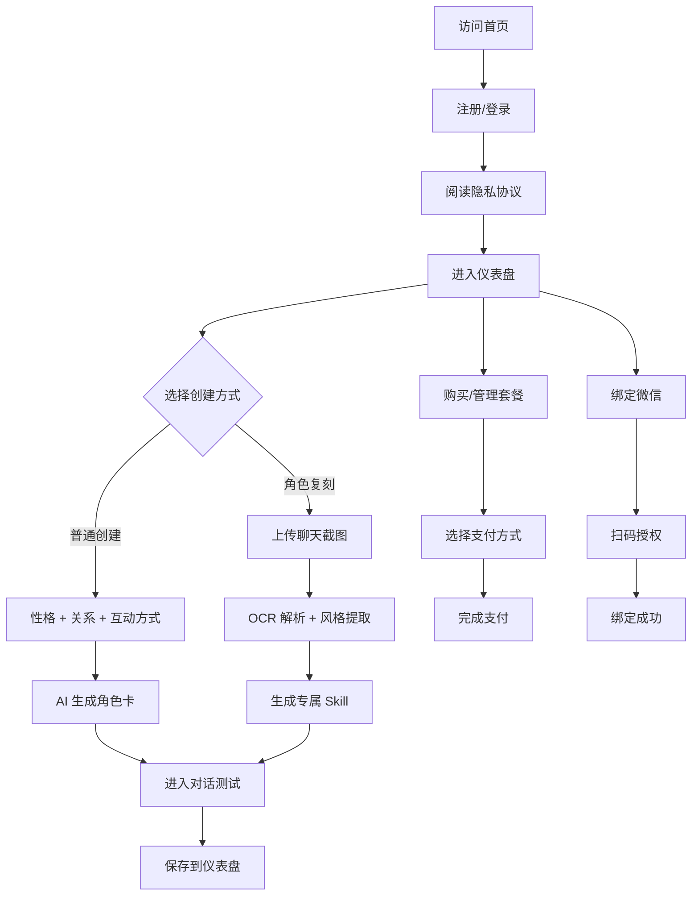

# 智微 (ZhiWei) 产品需求文档

## 1. 产品概述

智微是一个 AI 驱动的对话角色复刻平台，让用户通过上传聊天记录或自定义配置，复刻真实人物的对话风格与性格特征，创造专属智能体陪伴伙伴。目标用户为 18-35 岁追求情感连接与个性化 AI 体验的年轻用户群体。

## 2. 核心功能

### 2.1 用户角色

| 角色 | 注册方式 | 核心权限 |
|------|----------|----------|
| 普通用户 | 手机号 / 微信注册 | 创建基础智能体、购买复刻次数 |
| 引力会员 | 套餐订阅 | 每月 30 次复刻、高级性格定制 |
| 共振会员 | 套餐订阅 | 无限次复刻、全部高级功能、数据备份 |

### 2.2 功能模块

1. **首页**：品牌展示、智能体推荐、套餐介绍、用户引导
2. **注册/登录页**：手机号验证码、微信扫码登录
3. **用户仪表盘**：智能体卡片管理、套餐状态、设置中心
4. **普通智能体创建**：性格选择、关系配置、互动方式、AI 生成
5. **角色复刻工作台**：聊天记录上传、智能分析、Skill 生成
6. **智能体详情与对话**：实时聊天、表情包回复、状态展示
7. **套餐购买页**：套餐对比、支付流程、订单管理
8. **微信绑定页**：二维码绑定、状态同步展示
9. **个人设置**：资料修改、消息提醒、隐私设置、数据导出
10. **帮助中心**：使用教程、FAQ、客服入口

### 2.3 页面详情

| 页面名称 | 模块名称 | 功能描述 |
|---------|---------|---------|
| 首页 | 英雄区 | 动态展示品牌理念"复刻 TA 的灵魂"，含产品演示视频 |
| 首页 | 智能体推荐 | 展示热门/官方预设智能体卡片 |
| 首页 | 套餐入口 | 套餐卡片对比展示，引流到购买页 |
| 注册/登录 | 验证码登录 | 手机号输入 → 60秒倒计时 → 短信验证 |
| 注册/登录 | 微信登录 | 二维码展示，扫描后自动登录 |
| 仪表盘 | 智能体网格 | 卡片瀑布流布局，按时间/使用频率排序 |
| 仪表盘 | 套餐卡片 | 展示当前套餐、剩余次数、升级入口 |
| 仪表盘 | 设置面板 | 表情包开关、回复速度、消息提醒 |
| 普通创建 | 性格选择 | 8+ 预设性格网格，含自定义输入框 |
| 普通创建 | 关系配置 | 关系类型单选卡片 + 关系深度滑块 |
| 普通创建 | AI 生成 | 进度条动画 + 角色卡片揭晓 |
| 复刻工作台 | 上传区 | 拖拽上传，最多 20 张 JPG/PNG/PDF |
| 复刻工作台 | 分析过程 | 4 阶段进度展示：解析 → 提取 → 建模 → 生成 |
| 复刻工作台 | Skill 预览 | 展示分析结果，可调整后确认 |
| 对话页 | 聊天窗口 | 气泡式聊天，含"对方正在输入"状态 |
| 对话页 | 表情包面板 | 上下文相关表情包推荐 |
| 套餐页 | 套餐对比 | 三档套餐特性表格 + 价格突出 |
| 套餐页 | 支付流程 | 微信/支付宝选择 → 扫码 → 成功页 |
| 微信绑定 | 二维码区域 | 动态二维码 + 绑定状态实时刷新 |
| 设置 | 数据导出 | 一键导出 JSON 格式用户数据 |
| 设置 | 账号注销 | 二次确认 + 72 小时清除提示 |
| 帮助中心 | 教程列表 | 图文/视频教程卡片分类展示 |

## 3. 核心流程

### 3.1 用户首次使用流程

用户访问首页 → 浏览产品功能与案例 → 点击"立即开始" → 手机号注册（接收验证码） → 完成首次隐私协议确认 → 进入仪表盘 → 系统引导用户选择"创建普通智能体"或"复刻真实角色"。

### 3.2 普通智能体创建流程

进入创建页 → 选择性格（温柔/傲娇/霸道/知性/元气/高冷/邻家/神秘） → 选择关系（朋友/恋人/家人/导师/同事/偶像/陌生人/对手/知己/宠物） → 设定互动方式（文字/语音/表情包） → 设定昵称与背景 → 点击"AI 生成" → 3 秒加载动画 → 展示生成的角色卡 → 确认创建 → 跳转对话页。

### 3.3 角色复刻流程

进入复刻工作台 → 阅读复刻说明 → 拖拽上传聊天截图（支持多文件） → 等待 OCR 解析（进度条） → 4 阶段分析展示：①称呼与口吻提取 ②口头禅与高频词 ③情感模式分析 ④关系背景建模 → 展示分析报告 → 用户调整细节 → 点击"生成 Skill" → 创建专属智能体 → 跳转对话页测试。

### 3.4 微信绑定流程

进入微信绑定页 → 系统生成唯一二维码 → 用户用微信扫描 → 微信端确认授权 → 实时状态轮询 → 绑定成功提示 → 后续对话支持微信端同步。

## 4. 用户界面设计

### 4.1 设计风格

- **主色调**：渐变紫（#7C5CFF）→ 樱粉（#FF8FB1）→ 暖橙（#FFB088），传递温暖而科技感
- **辅助色**：深空蓝（#1A1B3A）作为深色背景，奶油白（#FAF7F2）作为浅色背景
- **强调色**：薄荷绿（#6FE7B8）用于成功状态，珊瑚红（#FF6B6B）用于警告
- **按钮风格**：胶囊形圆角（border-radius: 999px），柔和阴影，hover 时轻微抬升
- **字体选择**：
  - 标题字体：Fraunces（衬线，富有表现力，用于品牌与情感标题）
  - 正文字体：Plus Jakarta Sans（圆润现代的无衬线）
  - 中文字体：思源宋体（Source Han Serif）配 思源黑体（Source Han Sans）
- **布局风格**：卡片化 + 大量留白，关键区域采用非对称网格
- **图标风格**：双色线性图标（Lucide 风格），关键操作使用微动效

### 4.2 页面设计概述

| 页面名称 | 模块名称 | UI 元素 |
|---------|---------|---------|
| 首页 | 英雄区 | 全屏渐变背景，巨型衬线标题，复刻人物剪影浮动 |
| 首页 | 智能体推荐 | 卡片网格，悬停时 3D 倾斜，顶部彩色光晕 |
| 仪表盘 | 智能体卡片 | 渐变头像 + 名字 + 性格标签，悬停展开操作菜单 |
| 普通创建 | 性格选择 | 大尺寸卡片网格，选中时金色边框 + 微光动画 |
| 复刻工作台 | 上传区 | 虚线边框拖拽区，悬停时紫色光晕，文件以缩略图网格展示 |
| 复刻工作台 | 分析过程 | 4 步骤时间轴，每步完成时图标变为勾选状态 |
| 对话页 | 聊天窗口 | 圆角气泡，AI 侧渐变背景，用户侧浅灰，左上角实时状态 |
| 套餐页 | 套餐对比 | 三列卡片，中间卡片突出（更高 + 渐变边框 + 徽章） |
| 微信绑定 | 二维码区域 | 中心悬浮卡片，背景动态渐变 |

### 4.3 响应式设计

桌面优先（≥ 1280px），向下兼容平板（768-1279px）和移动端（< 768px）。
- 桌面端：多列网格，侧边导航
- 平板端：双列网格，顶部导航
- 移动端：单列布局，底部 Tab 导航，关键操作使用全屏弹层

### 4.4 视觉氛围与动效

- **背景氛围**：使用 CSS 径向渐变 + 噪点纹理 + 模糊光斑（CSS-only 方案）
- **加载动效**：智能体创建/分析过程中使用自定义动画（脉冲圆环 + 进度条）
- **微交互**：按钮悬停、卡片翻转、消息气泡淡入滑入、状态指示器呼吸效果
- **首屏动效**：标题字符逐个淡入，副标题与 CTA 错峰出现
- **页面切换**：使用 View Transitions API 实现平滑过渡
