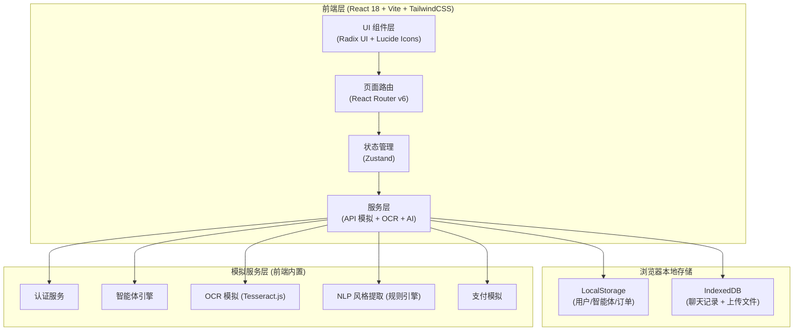
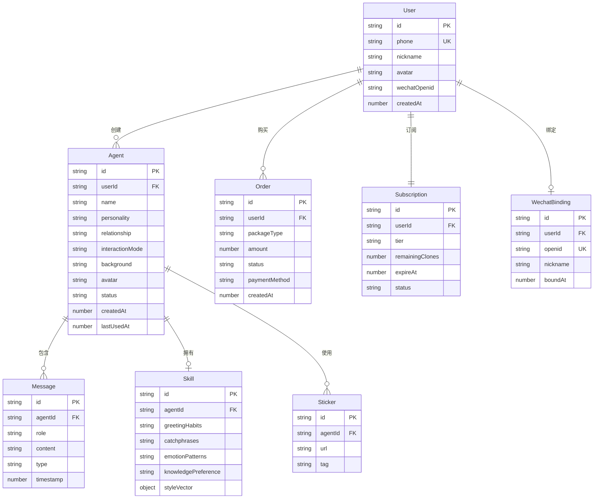

# 智微 (ZhiWei) 技术架构文档

## 1. 架构设计

本项目采用纯前端单页应用架构，使用浏览器本地存储模拟后端数据，便于演示与本地运行。



## 2. 技术选型

- **前端框架**：React@18 + TypeScript
- **构建工具**：Vite@5
- **样式方案**：TailwindCSS@3 + 自定义 CSS 变量
- **UI 基础组件**：Radix UI Primitives（无样式可访问性组件）
- **图标库**：Lucide React
- **字体**：Fraunces + Plus Jakarta Sans + 思源宋体/黑体（通过 Google Fonts / CDN）
- **状态管理**：Zustand（轻量级）
- **路由**：React Router@6
- **动效**：Framer Motion（关键交互）
- **OCR 引擎**：Tesseract.js（浏览器端 OCR）
- **图片处理**：browser-image-compression
- **初始化工具**：vite + create-vite
- **后端**：None（纯前端 + LocalStorage 模拟）
- **数据库**：LocalStorage + IndexedDB（浏览器内置）

## 3. 路由定义

| 路由 | 用途 |
|------|------|
| `/` | 首页：品牌展示、智能体推荐、套餐入口 |
| `/login` | 登录注册页：手机号验证码 + 微信扫码 |
| `/dashboard` | 用户仪表盘：智能体管理 + 套餐状态 + 设置 |
| `/create` | 普通智能体创建向导（多步骤） |
| `/clone` | 角色复刻工作台：上传 + 分析 + 生成 |
| `/agent/:id` | 智能体对话页：实时聊天 + 状态 |
| `/pricing` | 套餐购买页：对比 + 支付流程 |
| `/wechat-bind` | 微信绑定页：二维码 + 状态同步 |
| `/settings` | 个人设置：资料、提醒、隐私、数据 |
| `/help` | 帮助中心：教程、FAQ、客服 |
| `/legal` | 隐私政策与用户协议 |
| `*` | 404 页面 |

## 4. 数据模型

### 4.1 数据模型定义



### 4.2 数据定义（前端 LocalStorage Schema）

```typescript
// User
interface User {
  id: string;
  phone: string;
  nickname: string;
  avatar: string;
  wechatOpenid?: string;
  createdAt: number;
}

// Agent
interface Agent {
  id: string;
  userId: string;
  name: string;
  personality: string;
  relationship: string;
  interactionMode: ('text' | 'voice' | 'sticker')[];
  background: string;
  avatar: string;
  status: 'active' | 'archived';
  skillId?: string;
  createdAt: number;
  lastUsedAt: number;
}

// Skill
interface Skill {
  id: string;
  agentId: string;
  greetingHabits: string[];
  catchphrases: string[];
  emotionPatterns: string[];
  knowledgePreference: string[];
  styleVector: { warmth: number; formality: number; humor: number; };
}

// Message
interface Message {
  id: string;
  agentId: string;
  role: 'user' | 'agent';
  content: string;
  type: 'text' | 'sticker' | 'voice';
  timestamp: number;
}

// Subscription
interface Subscription {
  tier: 'normal' | 'gravity' | 'resonance';
  remainingClones: number;
  expireAt: number;
  status: 'active' | 'expired';
}
```

## 5. 服务层 API 设计（前端模拟）

```typescript
// 认证服务
authAPI = {
  sendCode(phone: string): Promise<{ success: boolean }>,
  login(phone: string, code: string): Promise<User>,
  loginByPassword(phone: string, password: string): Promise<User>,
  wechatLogin(code: string): Promise<User>,
  logout(): void,
}

// 智能体服务
agentAPI = {
  createNormal(config: AgentConfig): Promise<Agent>,
  cloneFromScreenshots(files: File[]): Promise<{ agent: Agent; skill: Skill; report: AnalysisReport }>,
  list(filter?: { sortBy: 'time' | 'usage' }): Promise<Agent[]>,
  update(id: string, data: Partial<Agent>): Promise<Agent>,
  delete(id: string): Promise<void>,
  duplicate(id: string): Promise<Agent>,
  sendMessage(agentId: string, content: string): Promise<Message>,
  getMessages(agentId: string): Promise<Message[]>,
}

// 套餐服务
pricingAPI = {
  getCurrentSubscription(): Promise<Subscription>,
  purchase(tier: string, method: 'wechat' | 'alipay'): Promise<Order>,
  upgrade(tier: string): Promise<Order>,
  cancel(): Promise<void>,
}

// 微信服务
wechatAPI = {
  generateQRCode(userId: string): Promise<{ qrUrl: string; status: 'pending' | 'scanned' | 'bound' }>,
  pollBindingStatus(qrId: string): Promise<WechatBinding>,
  unbind(): Promise<void>,
}

// 设置服务
settingsAPI = {
  updateSettings(settings: UserSettings): Promise<void>,
  exportData(): Promise<Blob>,
  deleteAccount(): Promise<void>,
}
```

## 6. 关键算法

### 6.1 风格提取算法（角色复刻核心）

基于 OCR 文本 + 规则引擎，模拟 NLP 提取：

1. **分句切分**：按标点切分对话气泡
2. **称呼提取**：正则匹配 `^[\u4e00-\u9fa5]{1,4}[，,：:]` 提取称呼前缀
3. **口头禅统计**：统计 2-4 字高频短语（出现 ≥ 3 次）
4. **情感模式**：基于情感词词典统计正/负/中性比例
5. **语气特征**：感叹号、省略号、emoji 频率
6. **风格向量**：综合输出 0-1 的多维向量

### 6.2 AI 回复生成（基于风格向量 + 模板）

```typescript
function generateReply(message: string, skill: Skill, personality: string): string {
  // 1. 根据情绪模式选择回复基调
  // 2. 根据风格向量调整语气强度
  // 3. 从口头禅库中抽样插入
  // 4. 应用性格模板（温柔/傲娇等）
  // 5. 返回生成文本
}
```

## 7. 项目结构

```
ai-nuyou/
├── index.html
├── package.json
├── vite.config.ts
├── tailwind.config.js
├── tsconfig.json
├── public/
│   ├── images/        # 占位图
│   └── fonts/         # 字体本地化（可选）
├── src/
│   ├── main.tsx       # 入口
│   ├── App.tsx        # 根组件 + 路由
│   ├── index.css      # 全局样式 + 字体
│   ├── pages/
│   │   ├── Home.tsx
│   │   ├── Login.tsx
│   │   ├── Dashboard.tsx
│   │   ├── CreateAgent.tsx
│   │   ├── CloneAgent.tsx
│   │   ├── AgentChat.tsx
│   │   ├── Pricing.tsx
│   │   ├── WechatBind.tsx
│   │   ├── Settings.tsx
│   │   ├── Help.tsx
│   │   ├── Legal.tsx
│   │   └── NotFound.tsx
│   ├── components/
│   │   ├── ui/        # 基础 UI（Button, Card, Input, Modal, Toast）
│   │   ├── layout/    # 布局（Header, Sidebar, Footer, Container）
│   │   ├── agent/     # 智能体相关（AgentCard, PersonalityPicker 等）
│   │   ├── chat/      # 对话相关（MessageBubble, ChatInput 等）
│   │   └── effects/   # 视觉效果（GradientBg, NoiseOverlay 等）
│   ├── store/
│   │   ├── userStore.ts
│   │   ├── agentStore.ts
│   │   └── uiStore.ts
│   ├── services/
│   │   ├── auth.ts
│   │   ├── agent.ts
│   │   ├── pricing.ts
│   │   ├── wechat.ts
│   │   ├── ocr.ts        # Tesseract.js 封装
│   │   ├── nlp.ts        # 风格提取
│   │   └── storage.ts    # LocalStorage 封装
│   ├── data/
│   │   ├── personalities.ts  # 8+ 性格预设
│   │   ├── relationships.ts  # 10+ 关系预设
│   │   ├── pricing.ts        # 套餐数据
│   │   └── stickers.ts       # 表情包 URL
│   ├── utils/
│   │   ├── id.ts
│   │   ├── format.ts
│   │   └── motion.ts
│   └── types/
│       └── index.ts
└── .trae/
    └── documents/
        ├── PRD.md
        └── tech-architecture.md
```

## 8. 性能与体验优化

- **首屏加载**：路由懒加载 + 图片懒加载 + 字体子集化
- **动画性能**：使用 transform/opacity，避免 layout 抖动
- **大文件处理**：分片上传（前端模拟），压缩后再存储
- **响应时间**：AI 回复 < 1 秒（本地生成），页面切换 < 300ms
- **离线能力**：LocalStorage 持久化关键数据，支持离线查看历史
- **错误处理**：统一 Toast 提示，关键操作提供撤销能力

## 9. 安全与合规

- **数据加密**：敏感字段（手机号）使用 base64 + 混淆处理（演示级别）
- **隐私保护**：所有数据存储在用户本地，刷新后保留
- **内容审核**：创建/对话时使用敏感词过滤（前端正则）
- **用户协议**：首次进入展示弹窗，需勾选确认
- **数据控制**：提供导出/删除功能，模拟 72 小时清除提示
